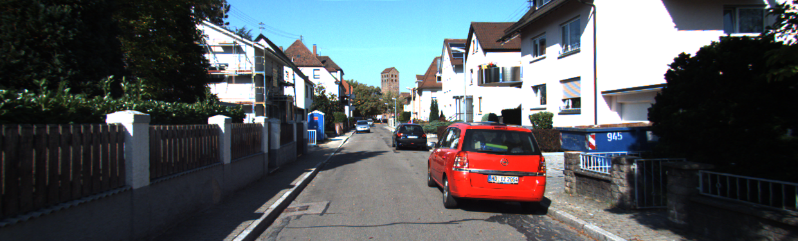

# Road-Segmentation
Code for SMAI Project on Road Segmentation with different Classifiers.

Presentation is still in updation


## Dependencies :

* Python2
* Sklearn
* Skimage
* Numpy 
* Glob


## Directory Structure for the code 
```
Road-Segmentation/
|
|--- datasets/
|    |
|    |--- data_road
|    |--- vgg
|
|--- NN_VGG/
|    |
|    |--- Output/
|	 |---Screenshots/
|    |--- nn_vgg.py
|    
|--- SUPERPIX/
|    |
|    |--- main.py
|	 |--- Screenshots/
|	 |--- segmentedImages/
|    |--- test_data.pkl
|    |--- train_data.pkl
|    |--- test_label.pkl
|    |--- train_label.pkl
|    |--- nb_model.pkl
|    
|--- PIX/
|    |
|    |--- main.py
|	 |--- segmentedImages/
|    |--- Screenshots
|
|--- GMM/
|    |
|    |--- main.py
|    |--- Screenshots	
|    
|--- README.md
|--- smai.pptx

```

In the datasets, there are two data files present

* data_road : containing the kitti dataset.
* vgg16 : vgg pretrained model

*NOTE* : In data_road folder, we are not using the `testing` folder, which is already present in the downloaded dataset, instead we created our own `testing` dataset folder. This folder has both the testing images and their ground truths. For this we have taken the last 50 images from the `training` folder i.e. from `uu_000048` to `uu_000097`. 

## Setup

1. Clone this repository: `git clone https://github.com/pulkitver1991/Road-Segmentation.git`
2. [Optional] Download Kitti Road Data:
    1. Retrieve kitti data url here: [http://www.cvlibs.net/download.php?file=data_road.zip](http://www.cvlibs.net/download.php?file=data_road.zip)
    2. Retrieve VGG pretrained model here: [https://s3-us-west-1.amazonaws.com/udacity-selfdrivingcar/vgg.zip](https://s3-us-west-1.amazonaws.com/udacity-selfdrivingcar/vgg.zip)

## Running the SUPERPIX Code

* The Code uses SuperPixel method of segmentation
* The training and testing vector is already created, and is provided in the directory
* If you want to create vector again, set the variable *create_vectors_again* high
* Naive bayes model is already learnt and provided in the directory, so can be used directly
* To fit a model again, set the variable *start_training_model* high
* Select the Classifier using *select_classifier*
* The available classifiers are : 

	```
	--- Naive Bayes (nb)
	--- SVM (svm)
	--- Random Forest (rf)
	--- KNN (knn)
	```
* Call `python main.py` to run the code	
* The result of the segmented images is saved in *SegmentedImages* Folder

* Some Segmented Results:

  

  


## Running the PIX Code

* The Code uses Pixelwise Implementation of segmentation
* The Code displays some intermediate work and may have some bugs
* The training and testing vector is not created in this case (due to large size)
* You can create the vectors by setting the variable *create_vectors_again* high and run the code
* To fit a model, change the name of the classifier in `classifier` function, set the `run_train` to high and run the code
* Select the Classifier in the classifier function
* The available classifiers can be : 

	```
	--- Naive Bayes 
	--- SVM 
	--- Random Forest 
	--- KNN 
	```
* Call `python main.py ../datasets/data_road/training ../datasets/data_road/testing` to run the code	
* The result of the segmented images is saved in *SegmentedImages* Folder

* Some Segmented Results:

  

  


## Running the GMM Code Code


* The Code uses GMM method for Segmentation
* Call `python main.py` to run the code	

* Some Segmented results:

 


## Running the NN_VGG Code

### Dependencies :

* Python3
* Tensorflow
* Scipy
* Skimage
* Numpy 
* Glob

### Steps

* The Code uses Pretrained VGG Model for Road segmentation. The reference for this code is taken from `https://github.com/udacity/CarND-Semantic-Segmentation.git`. The code is meant for making an attempt to CNN and help is taken from the above repository.
* The code runs on Python3
* Call `python3 nn_vgg.py` to run the code	
* The result of the segmented images is saved in *Output* Folder

* Some Segmented Results:

  

  
